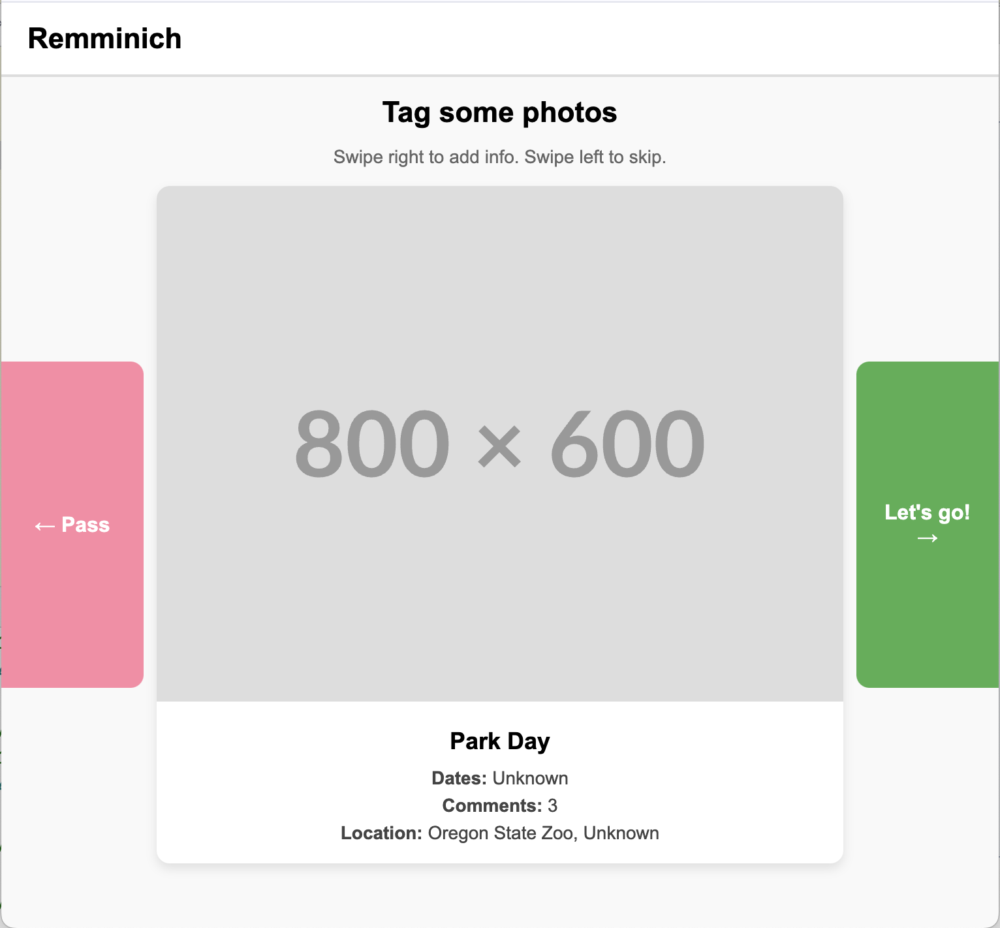

# **Immich family history app**

<p align="center">
  
</p>

## *A self-hosted web app to facilitate family photo archiving*

[Installing With Immich (Recommended)](#running-with-immich)
[Bootstrapping for development](#installing-python)

## Running with Immich

Add the following into your docker compose as a new service along side other immich services. Make sure Remminich in same network as immich.

See the sample docker-compose-all-immich.yml file for reference.

```
services:
  # Other services...
  remminch:
    container_name: remminch
    image: ghcr.io/marcrleonard/remminich:latest
    ports:
      - "8001:8001"
    env_file:
      - .env
```

In your `.env` file, add:
```
IMMICH_API_KEY=youApiKey
IMMICH_URL=http://immich-server:2283/
```
Add your api key, and immich url The immmich URL is likely to be the as above, unless its been changed in your docker-compose file.

Then, cd into where your immich docker compose is, and restart everything:
```
docker compose down
docker compose up -d
```


## Installing Python
1. `curl -LsSf https://astral.sh/uv/install.sh | sh`
2. `uv python install 3.12`

## Bootstrap Project
1. `git clone https://github.com/marcrleonard/Remminich.git`
2. `cd Remminich`
3. `uv venv --python=3.12`
4. `source .venv/bin/activate`
5. `pip3 install -r requirements.txt`


## **Problem**

***TL;DR:** Immich is designed to handle modern ongoing storage and organization for digital photos, not a collective family archive of scanned analog photographs.*

I’ve taken on the task of scanning and cataloging a collection of thousands of negatives and prints from my family’s collection, spanning from the 1950s through the 2000s. Digitizing the photos is a project unto itself, but gathering information about the people, places, dates, and events in them is a large undertaking as well. I’ve been looking for a software solution that is self-hosted and allows multiple family members to view and collaboratively contribute metadata to this photo collection as it grows. Ideally this solution would be web-based and supports multiple users.

[Immich](https://immich.app/) is an amazing personal photo application that comes quite close\! But Immich isn’t actually meant for this family history case, and so it has lots of small issues that that make it ill-suited for this specialized task:

* Immich doesn’t allow for approximate dates – each date must have a day and time assigned, which isn’t ideal when identifying analog photos from the past.  
* Immich doesn’t allow for batch-modifying dates *relatively*. This is problematic when we know the order of a group of photos and their approximate dates. In Immich, selecting them all and changing the date disrupts their relative order, since they will all be set to a single identical timestamp.  
* Only the owner account of the photos can see and modify face/people data.  
* Only the owner account of the photos can see and modify geolocation data.  
* If we work around some of these limitations by sharing a single account/login with the whole family, we cannot have a reviewable log of changes and contributions with attribution.

In short, while Immich is amazing for organizing photos, especially in one’s personal collection, it is not fully equipped to allow a family to collaboratively add historical metadata to the photos.
